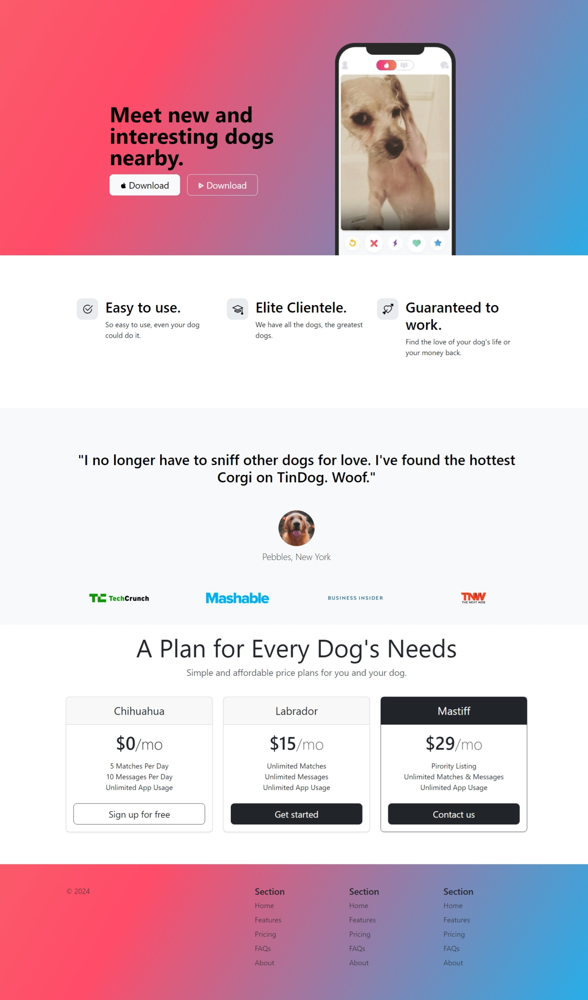

# TinDog - Tinder for Dogs 🐶

Welcome to TinDog, a fun and interactive landing page for dog lovers!



## Table of Contents
- [Introduction](#introduction)
- [Features](#features)
- [Tech Stack](#tech-stack)
- [Installation](#installation)
- [Usage](#usage)
- [Contributing](#contributing)
- [License](#license)

## Introduction

TinDog is a landing page designed to mimic Tinder, but for dogs! It showcases Bootstrap 5's capabilities and responsiveness to create an engaging user experience.

## Features

- **Responsive Design:** Optimized for various screen sizes, from mobile devices to desktops.
- **Easy to Use:** Simple and intuitive interface, ensuring users can navigate effortlessly.
- **Client Testimonials:** Featured testimonials from happy "users."
- **Pricing Plans:** Clearly defined pricing tiers for different user needs.

## Tech Stack

- **Frontend:** HTML5, CSS3, Bootstrap 5
- **JavaScript:** Vanilla JavaScript
- **Version Control:** Git, GitHub

## Installation

To run TinDog locally, follow these steps:

1. Clone the repository:
   ```bash
   git clone https://github.com/your-username/tindog.git
   cd tindog
Open index.html in your preferred web browser.
Usage
Explore TinDog by clicking buttons, navigating through sections, and interacting with its features.

Contributing
Contributions are welcome! Please fork the repository and create a pull request.

License
This project is licensed under the MIT License - see the LICENSE file for details.
